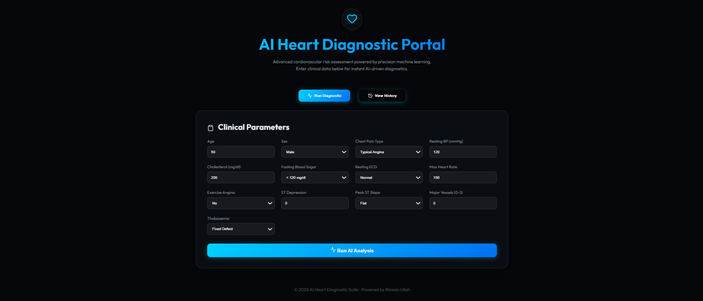

# 🫀 AI Heart Diagnostic: The End-to-End Journey

> [!IMPORTANT]
> This repository represents a complete transition from **Raw Data Science** to a **Production-Ready AI Application**. It combines a rigorous machine learning research pipeline with a premium MERN-stack diagnostic portal.

---

## 🖼️ App Preview



## 🗺️ Project Overview

This project is divided into two distinct yet integrated ecosystems:

### 1. 🟣 [AI Diagnostics Core](./ai_diagnostics)
**The Research & Development Engine.**
- **Focus**: Data cleaning, Exploratory Data Analysis (EDA), and Model Benchmarking.
- **Goal**: Identifying the most accurate and safe machine learning architecture for cardiac risk assessment.
- **Outcome**: Optimized **XGBoost** model with **87.50% Recall** for maximum clinical safety.

### 2. 🔵 [Heart AI Portal](./heart-ai-portal)
**The Enterprise Web Application.**
- **Focus**: UI/UX, Real-time inference, and Data persistence.
- **Goal**: Providing a beautiful, interactive interface for clinicians to use the AI models in a real-world setting.
- **Tech Stack**: **MERN** (MongoDB, Express, React, Node.js) + Python Bridge.

---

## 🚀 Key Features

- **XGBoost Intelligence**: Powered by the industry-leading gradient boosting algorithm.
- **Midnight UI/UX**: A high-fidelity, dark-mode clinical dashboard with glassmorphism and smooth animations.
- **Instant Diagnostics**: Real-time communication between the Node.js backend and Python ML scripts.
- **Diagnostic History**: Full tracking of patient assessments stored securely in MongoDB.
- **Multi-Algorithm Tournament**: Comparison results from 5 different AI architectures (XGBoost, Random Forest, SVM, KNN, Logistic Regression).

---

## 🛠️ Combined Setup Guide

### Prerequisites
- **Node.js** (v18+)
- **Python** (v3.10+)
- **MongoDB** (Local or Atlas)

### 1. AI Core Setup (ML Research)
```bash
cd ai_diagnostics
python -m venv venv
.\venv\Scripts\activate
pip install -r requirements.txt
python scripts/train.py  # Benchmark the models
```

### 2. Web Portal Setup (MERN App)
```bash
cd heart-ai-portal
npm install
# Configure MongoDB in backend/.env
npm run dev
```

---

## 📊 Model Performance Highlights

| Metric | Result |
| :--- | :--- |
| **Winning Model** | XGBoost Classification |
| **Training Accuracy** | **88.33%** |
| **Clinical Recall (Safety)** | **87.50%** |
| **Latency** | < 100ms (Real-time inference) |

---

## 📁 Repository Structure

```text
.
├── ai_diagnostics/          # Python ML Research Workspace
│   ├── data/                # Clinical Datasets (UCI Cleveland)
│   ├── models/              # Saved model binary files (.joblib)
│   ├── scripts/             # Data loading, EDA, and comparison scripts
│   └── app.py               # Streamlit Research Dashboard
├── heart-ai-portal/         # MERN Stack Production Web App
│   ├── backend/             # Node.js API with Python Bridge
│   ├── frontend/            # React + Framer Motion UI
│   └── ml/                  # API-optimized prediction scripts
└── README.md                # Unified Project Documentation
```

---

## 📄 Clinical Disclaimer
This tool is for educational and research purposes only. It is not intended to replace professional medical advice, diagnosis, or treatment. Always seek the advice of a qualified healthcare provider regarding a medical condition.

---

