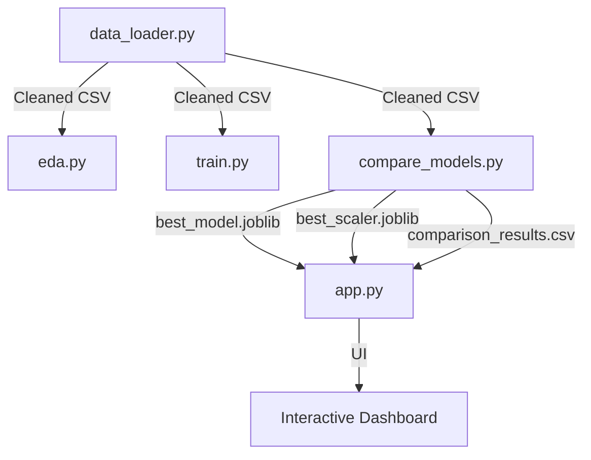

# ❤️ AI Heart Diagnostic Suite

An end-to-end Machine Learning pipeline and interactive diagnostic dashboard for predicting heart disease using clinical data.

---

## 🗺️ Project Roadmap
Here's a full map of our learning journey:

./readme_images/Project_ReadMap.svg

---

## 📥 1. Data Acquisition
The first step is bringing the data into our project environment.

### The UCI Heart Disease Dataset
Our data comes from the **UCI Machine Learning Repository** — one of the oldest and most trusted sources of public datasets for ML research.

./readme_images/dataset_profile.svg

### The Acquisition Flow — `data_loader.py`
This script handles the downloading and initial loading of the data.

./readme_images/data_acquisition_flow.svg

#### 3 Key Concepts
1.  **No Column Names**: The raw `.data` file from UCI has no header. We manually assign names using a Python list.
2.  **Handling `?` Values**: Missing lab readings are marked with `?`. We must handle these before processing.
3.  **Binary Encoding**: We convert the multi-class target (0-4) into binary (0 = healthy, 1 = disease) to simplify the prediction problem.

**Output:**
- `data/heart_disease_raw.csv` (Original)
- `data/heart_disease_cleaned.csv` (Ready for EDA)

---

## 🧹 2. Data Cleaning
"Garbage in, garbage out" — a model is only as good as the data it learns from.

./readme_images/data_cleaning_problems.svg

### Key Problems Solved:
*   **Problem 1: Missing Values (`?` → `NaN`)**: We use `pd.read_csv(..., na_values="?")` to treat `?` as missing values.
*   **Problem 2: Missing Value Strategy**: We use `df.dropna()`. Losing 6 out of 303 rows is acceptable for this dataset.
    ./readme_images/missing_value_strategies.svg
*   **Problem 3: Target Encoding**: Converting severity levels to a clean yes/no binary target.
    ./readme_images/lambda_target_encoding.svg
*   **Problem 4: Data Types**: Ensuring all columns are numeric (float64/int64) for mathematical processing.

> [!WARNING]
> Skipping cleaning leads to "silent failure" where models train on corrupt data and produce dangerous, incorrect medical predictions.
> 
./readme_images/skip_cleaning_consequences.svg

---

## 📊 3. Exploratory Data Analysis (EDA)
Understanding the data before modeling.

./readme_images/eda_motivation.svg

### Key Visualizations:
1.  **Target Distribution**: Checking if the dataset is balanced (138 healthy vs 165 disease).
2.  **Correlation Heatmap**: Identifying which features (like `cp`, `exang`, `oldpeak`) correlate most with disease.
   ./readme_images/correlation_scale_explainer.svg
3.  **Age Distribution**: Visualizing how disease prevalence peaks in the 55–65 age range.
4.  **Chest Pain Type vs Disease**: Revealing that asymptomatic patients (`cp=3`) often have the highest disease counts.
    ./readme_images/chest_pain_insight.svg

**Technology Stack:**
*   **Matplotlib**: The "engine" (canvas, saving files).
*   **Seaborn**: The "smart brush" (drawing complex statistical charts).

---

## 🤖 4. Model Training
This is where the machine actually learns to map inputs ($X$) to answers ($y$).

./readme_images/what_training_means.svg

### The Training Pipeline:
1.  **X/y Split**: Separating features from the target variable.
2.  **Train/Test Split**: Reserving 20% of data for final evaluation to prevent "cheating."
    ./readme_images/train_test_why_it_matters.svg
3.  **Feature Scaling**: Using `StandardScaler` to bring all features (Age vs. Cholesterol) into the same range.
    ./readme_images/feature_scaling_problem.svg
4.  **Random Forest**: An ensemble of 100 decision trees that use "majority voting" to make robust predictions.
    ./readme_images/decision_tree_example.svg

### Evaluation Metrics:
We use a **Confusion Matrix** to track exactly where the model makes errors (False Positives vs. False Negatives).
./readme_images/actual_confusion_matrix.svg

---

## ⚖️ 5. Multi-Algorithm Comparison
Finding the absolute best model for our specific data.

> "No single algorithm is best for every problem."
./readme_images/no_free_lunch.svg

### Algorithms Evaluated:
*   **Logistic Regression**: Simple, interpretable baseline.
    ./readme_images/logistic_regression_intuition.svg
*   **KNN (K-Nearest Neighbors)**: Predicts based on the most similar past patients.
    ./readme_images/knn_intuition.svg
*   **SVM (Support Vector Machine)**: Finds the "maximum margin" boundary. **Our Winner!**
    ./readme_images/svm_maximum_margin.svg
*   **Random Forest & XGBoost**: Advanced ensemble methods using bagging and boosting.
    ./readme_images/bagging_vs_boosting_diagram.svg

### Why Recall Matters
In medical diagnostics, we prioritize **Recall** to minimize False Negatives (missing a sick patient).
./readme_images/precision_recall_tradeoff.svg

---

## 🖥️ 6. Interactive AI Dashboard
A production-ready tool built with **Streamlit** for real-time diagnostics.

.s/readme_images/streamlit_concept.svg

### Features:
*   **Real-time Prediction**: Model reruns instantly as sliders move.
*   **Intelligent Caching**: Uses `@st.cache_resource` for blazing-fast model loading.
    ./readme_images/cache_resource_flow.svg
*   **Dynamic UI**: Red/Green alerts based on diagnostic results.
*   **Performance Tracking**: Live metrics pulled directly from our benchmark results.

---

## 🔗 How Everything Connects

---
*Created with ❤️ for AI Diagnostic Research by Rizwan Ullah*